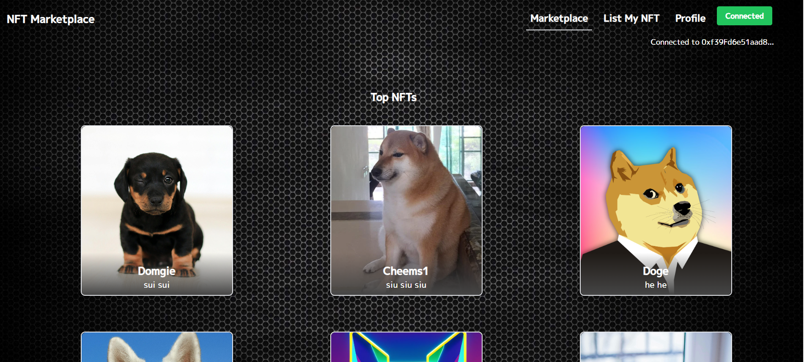
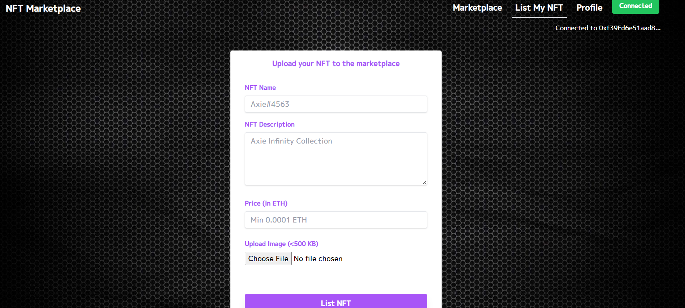
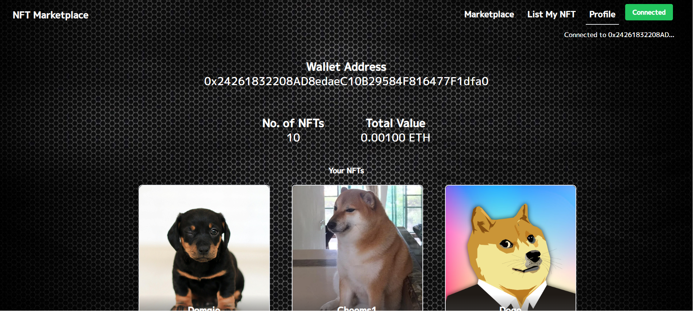

# Basic NFT Marketplace end to end

# Project live link -`https://nft-marketplace-66158.web.app/` 

This is the marketplace of all the nfts


This is where you can list your own nft


This is your collection of nfts



To set up the repository and run the marketplace locally, run the below
```bash
git clone 'https://github.com/Swarup9873/NFT-Marketplace.git'
npm install
npm start
```
